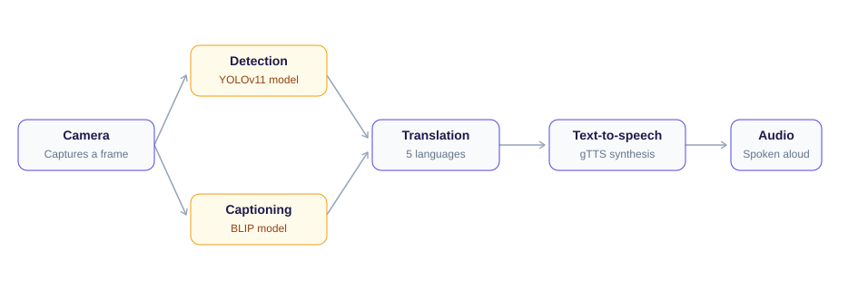

<div align="center">


<h3>See the world. Hear the world.</h3>

<p>Real-time environmental narration for the visually impaired — YOLOv11 detection, BLIP scene understanding, and multilingual voice feedback.</p>

[](https://python.org)
[](https://streamlit.io)
[](LICENSE)

<p>
<a href="#how-it-works">How it works</a> ·
<a href="#quickstart">Quickstart</a> ·
<a href="#accessibility-first-design">Accessibility</a> ·
<a href="#project-structure">Structure</a> ·
<a href="#contributing">Contributing</a>
</p>

</div>

---

## What is IAVS?

IAVS is an accessibility-first computer vision system that narrates the world in real time. Point a webcam — or an ESP32-CAM module — at a scene, and the system detects hazards and signs, describes what it sees in natural language, translates that description into the user's preferred language, and speaks it aloud. No screen reading required; every interaction is voice-guided from the start.

## Why it matters

Navigating an unfamiliar environment without sight means relying on hearing, memory, and whatever assistance is nearby. IAVS aims to give that awareness back in real time — turning a camera feed into spoken, actionable information about what's ahead: a sign, a crossing, an obstacle, a scene.

## How it works

<div align="center">

</div>

<p align="center"><sub>Amber boxes run in parallel — sign/object detection and scene captioning happen independently, then converge before translation.</sub></p>

1. **Camera** captures a frame (webcam or ESP32-CAM stream)
2. **Detection** (YOLOv11) and **captioning** (BLIP) run on that frame
3. The result is **translated** into the selected language
4. **Text-to-speech** (gTTS) converts it to audio
5. The user **hears** the result

## Core capabilities

| Vision | Language | Interaction |
|---|---|---|
| Custom YOLOv11 model for traffic signs & road hazards | Translation into 5 languages via `deep-translator` | Voice-guided menu — no reading required |
| Pretrained YOLO (`yolo11n.pt`) for general objects | Spoken feedback via gTTS + pygame | Simple 3-step flow: mode → language → camera |
| BLIP scene captioning for full contextual description | | Works with USB webcam or ESP32-CAM |

## Accessibility-first design

Every part of the interaction is designed to not require sight or reading:

- Navigation prompts are spoken, not just displayed
- A simple, consistent 3-step flow (mode → language → start) rather than a complex menu tree
- High-contrast interface as a fallback for low-vision (not no-vision) users
- No step requires typing — selection-based interaction throughout

## Multilingual voice feedback

| Language | Code |
|---|---|
| English | `en` |
| Kannada | `kn` |
| Hindi | `hi` |
| Tamil | `ta` |
| Telugu | `te` |

Translation via [`deep-translator`](https://github.com/nidhaloff/deep-translator) · TTS via [`gTTS`](https://github.com/pndurang/gTTS) · Playback via `pygame`

## Hardware

**Webcam** — works out of the box with any standard USB webcam, no extra setup.

**ESP32-CAM** — for a low-cost, portable deployment. Flash [`firmware/ESP_CAM.ino`](firmware/ESP_CAM.ino) to the board and point the app at its stream URL.

## Tech stack

| Layer | Technology |
|---|---|
| Interface | Streamlit |
| Computer vision | OpenCV, Ultralytics YOLOv11 |
| Scene understanding | Hugging Face Transformers (BLIP) |
| Translation | deep-translator |
| Text-to-speech | gTTS |
| Audio playback | pygame |
| Language | Python 3.8+ |

## Quickstart

```bash
git clone https://github.com/Karthik-bhandarkar/Intelligent-Assistive-System.git
cd Intelligent-Assistive-System
pip install -r requirements.txt
streamlit run app/streamlit_app.py
```

The app opens at `http://localhost:8501`. PyTorch and Ultralytics will download model weights on first run — this can take a few minutes.

## Usage

**Web app** — three steps: select mode (captioning / detection / combined) → select language → start camera. All prompts are spoken.

**CLI launcher** — an alternative, terminal-based entry point:

```bash
python scripts/main.py
```

<details>
<summary>Advanced: individual scripts and flags</summary>

- `scripts/Image_captioning_ESP32.py` — live captioning loop
- `scripts/Sign_scan_Esp32.py --source webcam` or `--source esp32` — sign detection on either input
- `scripts/live.py` — visual-only stream preview, no audio
- `scripts/manual.py` — manual webcam capture or file upload for one-off captioning

</details>

## Project structure

```
Intelligent-Assistive-System/
├── app/
│   └── streamlit_app.py          # Web UI entry point
├── src/                           # Core modules
│   ├── capture/esp_stream.py
│   ├── detection/yolo_sign_detection.py
│   ├── captioning/blip_caption.py
│   ├── translation/translator.py
│   └── tts/tts_audio.py
├── scripts/                       # CLI launcher + standalone tools
│   ├── main.py
│   ├── Image_captioning_ESP32.py
│   ├── Sign_scan_Esp32.py
│   ├── live.py
│   └── manual.py
├── models/                        # best.pt, best.onnx, yolo11n.pt
├── assets/
│   ├── audio/                     # pre-recorded alert clips
│   ├── branding/                  # logo assets
│   ├── diagrams/                  # pipeline.svg
│   └── screenshots/
├── firmware/
│   └── ESP_CAM.ino                # ESP32-CAM firmware
├── training/                      # YOLOv11 training notebooks & dataset
├── requirements.txt
└── README.md
```

## Roadmap

| Now | Next | Later |
|---|---|---|
| Core detection + captioning + voice pipeline | Offline TTS fallback (pyttsx3) for no-internet use | Edge deployment (ONNX/TensorRT) |
| ESP32-CAM + webcam support | Persistent object tracking across frames | Navigation guidance ("obstacle ahead, move right") |
| 5-language translation | Expanded languages (Bengali, Marathi, Malayalam) | ESP32-CAM power optimization |

## Contributing

```bash
git checkout -b feature/your-feature-name
# make changes, update docs
git commit -m "feat: short description"
git push origin feature/your-feature-name
# open a Pull Request
```

Follow [PEP 8](https://peps.python.org/pep-0008/), keep modules focused, document any public function you add.

**Good first issues:** language support, UI accessibility improvements, documentation, performance profiling.

## Acknowledgements

- [Ultralytics](https://ultralytics.com) for YOLOv11
- [Salesforce / Hugging Face](https://huggingface.co/Salesforce/blip-image-captioning-base) for BLIP
- [Streamlit](https://streamlit.io) for the UI framework

<div align="center">
<sub>Built with care for accessibility · Bengaluru, India</sub>
</div>
